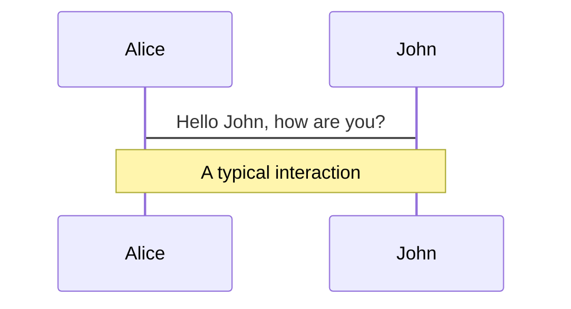
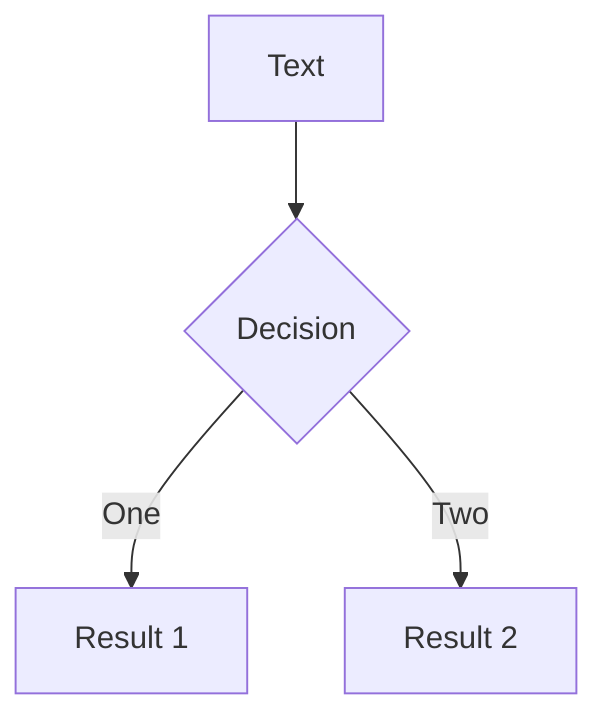
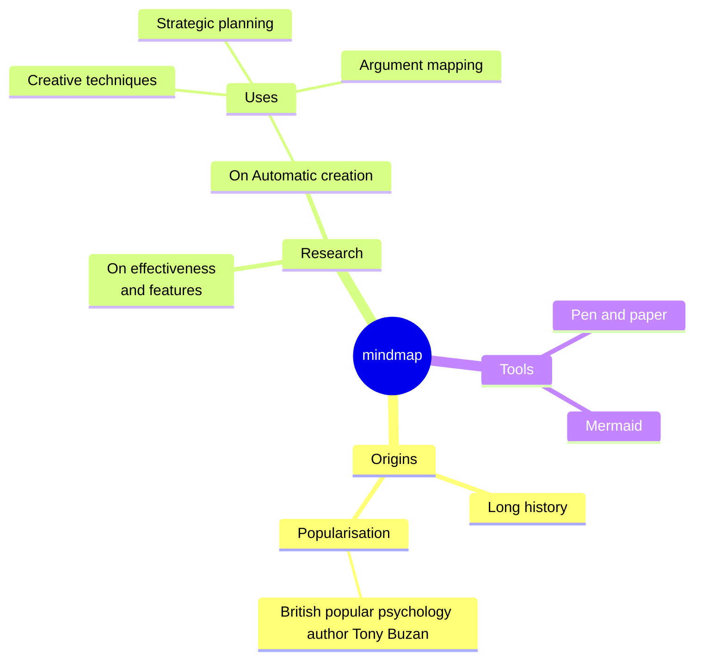
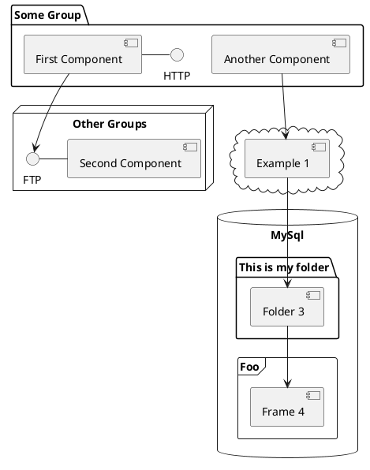

---
# try also 'default' to start simple
theme: ./theme
# random image from a curated Unsplash collection by Anthony
# like them? see https://unsplash.com/collections/94734566/slidev
background: './rubin.png'
# some information about your slides (markdown enabled)
title: CC w/ OS 4 GPX
info: |
  ## Intro to using Claude Code with OpenSpec to build software
# apply UnoCSS classes to the current slide
class: text-center
# https://sli.dev/features/drawing
drawings:
  persist: false
# slide transition: https://sli.dev/guide/animations.html#slide-transitions
transition: slide-left
# enable Comark Syntax: https://comark.dev/syntax/markdown
comark: true
---

# CC w/ OS 4 GPX

<!--
Tentative title
-->

---
transition: slide-left
class: 'flex items-center justify-center !p-0'
---


<!--
Why are we here?
-->

---
transition: slide-left
layout: image-right
image: /ralph.jpg
---

# Goals

<v-clicks>

- Feel comfortable using the CC TUI to build software using the OpenSpec framework
- A better understanding of the current state of the art
- Ideas for further research

</v-clicks>

<v-click>

## Non-goals

- Building a unicorn B2B SaaS startup in a weekend

</v-click>

---
class: text-center
---

# Structure

<div class="flex items-center justify-center gap-10 mt-32 text-6xl">
  <div class="px-10 py-8 bg-blue-900 rounded-2xl">Lecture</div>
  <div class="text-5xl">→</div>
  <div class="px-10 py-8 bg-green-900 rounded-2xl">Setup</div>
  <div class="text-5xl">→</div>
  <div class="px-10 py-8 bg-orange-900 rounded-2xl">Build</div>
</div>

---
layout: center
---

<Youtube id="SmHgtyym6OA?start=1512" width="900" height="506" />

<!-- Rich Harris - Frameworks for humans in the age of machines at NY Web Performance Meetup-->

---
layout: center
---


<!-- 
Markdown[9] is a lightweight markup language for creating formatted text using a plain-text editor.

 -->

---
class: text-center
---

<div class="flex items-center justify-center gap-24 mt-16">
  <div v-click class="flex flex-col items-center">
    
    <p class="mt-4 text-2xl">John Gruber</p>
  </div>

  <div v-click class="flex flex-col items-center">
    
    <p class="mt-4 text-2xl">Aaron Swartz</p>
  </div>
</div>

---
layout: center
---


<!-- 
On January 6, 2011, Swartz was arrested by Massachusetts Institute of Technology (MIT) police on state breaking-and-entering charges, after connecting a computer to the MIT network in an unmarked and unlocked closet and setting it to download academic journal articles from JSTOR using a guest user account issued to him by MIT.[14][15] Federal prosecutors, led by Carmen Ortiz, charged him with two counts of wire fraud and eleven violations of the Computer Fraud and Abuse Act,[16] carrying a cumulative maximum penalty of $1 million in fines, 35 years in prison, asset forfeiture, restitution, and supervised release.[17] Swartz declined a plea bargain under which he would have served six months in federal prison.[18] Two days after the prosecution rejected a counter-offer by Swartz, he was found dead in his Brooklyn apartment.[19][20] In 2013, Swartz was inducted posthumously into the Internet Hall of Fame.[21]
 -->

---
class: 'flex !p-0'
---

<div class="w-1/2 flex items-center p-12">

<v-click>

> One of Altman’s batch mates in the first Y Combinator cohort was Aaron Swartz, a brilliant but troubled coder who died by suicide in 2013 and is now remembered in many tech circles as something of a sage. Not long before his death, Swartz expressed concerns about Altman to several friends. “You need to understand that Sam can never be trusted,” he told one. “He is a sociopath. He would do anything.”
>
> <span class="block mt-4 text-sm opacity-70">— Ronan Farrow & Andrew Marantz, <cite>“Sam Altman May Control Our Future—Can He Be Trusted?”</cite>, The New Yorker, April 6 2026</span>

</v-click>

</div>

<div class="w-1/2 h-full">
  <video autoplay loop muted class="w-full h-full object-cover">
    <source src="/altman_small.mp4" type="video/mp4" />
  </video>
</div>

---

# Clicks Animations

You can add `v-click` to elements to add a click animation.

<div v-click>

This shows up when you click the slide:

```html
<div v-click>This shows up when you click the slide.</div>
```

</div>

<br>

<v-click>

The <span v-mark.red="3"><code>v-mark</code> directive</span>
also allows you to add
<span v-mark.circle.orange="4">inline marks</span>
, powered by [Rough Notation](https://roughnotation.com/):

```html
<span v-mark.underline.orange>inline markers</span>
```

</v-click>

<div mt-20 v-click>

[Learn more](https://sli.dev/guide/animations#click-animation)

</div>

---

# Motions

Motion animations are powered by [@vueuse/motion](https://motion.vueuse.org/), triggered by `v-motion` directive.

```html
<div
  v-motion
  :initial="{ x: -80 }"
  :enter="{ x: 0 }"
  :click-3="{ x: 80 }"
  :leave="{ x: 1000 }"
>
  Slidev
</div>
```

<div class="w-60 relative">
  <div class="relative w-40 h-40">
    
    
    
  </div>

  <div
    class="text-5xl absolute top-14 left-40 text-[#2B90B6] -z-1"
    v-motion
    :initial="{ x: -80, opacity: 0}"
    :enter="{ x: 0, opacity: 1, transition: { delay: 2000, duration: 1000 } }">
    Slidev
  </div>
</div>

<!-- vue script setup scripts can be directly used in markdown, and will only affects current page -->
<script setup lang="ts">
const final = {
  x: 0,
  y: 0,
  rotate: 0,
  scale: 1,
  transition: {
    type: 'spring',
    damping: 10,
    stiffness: 20,
    mass: 2
  }
}
</script>

<div
  v-motion
  :initial="{ x:35, y: 30, opacity: 0}"
  :enter="{ y: 0, opacity: 1, transition: { delay: 3500 } }">

[Learn more](https://sli.dev/guide/animations.html#motion)

</div>

---

# $\LaTeX$

$\LaTeX$ is supported out-of-box. Powered by [$\KaTeX$](https://katex.org/).

<div h-3 />

Inline $\sqrt{3x-1}+(1+x)^2$

Block

$$
{1|3|all}
\begin{aligned}
\nabla \cdot \vec{E} &= \frac{\rho}{\varepsilon_0} \\
\nabla \cdot \vec{B} &= 0 \\
\nabla \times \vec{E} &= -\frac{\partial\vec{B}}{\partial t} \\
\nabla \times \vec{B} &= \mu_0\vec{J} + \mu_0\varepsilon_0\frac{\partial\vec{E}}{\partial t}
\end{aligned}
$$

[Learn more](https://sli.dev/features/latex)

---

# Diagrams

You can create diagrams / graphs from textual descriptions, directly in your Markdown.

<div class="grid grid-cols-4 gap-5 pt-4 -mb-6">









</div>

Learn more: [Mermaid Diagrams](https://sli.dev/features/mermaid) and [PlantUML Diagrams](https://sli.dev/features/plantuml)

---
foo: bar
dragPos:
  square: 691,32,167,_,-16
---

# Draggable Elements

Double-click on the draggable elements to edit their positions.

<br>

###### Directive Usage

```md

```

<br>

###### Component Usage

```md
<v-drag text-3xl>
  <div class="i-carbon:arrow-up" />
  Use the `v-drag` component to have a draggable container!
</v-drag>
```

<v-drag pos="663,206,261,_,-15">
  <div text-center text-3xl border border-main rounded>
    Double-click me!
  </div>
</v-drag>


###### Draggable Arrow

```md
<v-drag-arrow two-way />
```

<v-drag-arrow pos="67,452,253,46" two-way op70 />

---
src: ./pages/imported-slides.md
hide: false
---

---

# Monaco Editor

Slidev provides built-in Monaco Editor support.

Add `{monaco}` to the code block to turn it into an editor:

```ts {monaco}
import { ref } from 'vue'
import { emptyArray } from './external'

const arr = ref(emptyArray(10))
```

Use `{monaco-run}` to create an editor that can execute the code directly in the slide:

```ts {monaco-run}
import { version } from 'vue'
import { emptyArray, sayHello } from './external'

sayHello()
console.log(`vue ${version}`)
console.log(
  emptyArray<number>(10).reduce(
    (fib) => [...fib, fib.at(-1)! + fib.at(-2)!],
    [1, 1],
  ),
)
```

---
layout: center
---

# PileUp

Press <kbd>space</kbd> to stack 'em up

<PileUp
  :images="[
    '/Screenshot 2026-04-14 at 21.20.04.png',
    '/Screenshot 2026-04-14 at 21.21.17.png',
    '/Screenshot 2026-04-14 at 21.21.52.png',
    '/Screenshot 2026-04-14 at 21.22.38.png',
    '/Screenshot 2026-04-14 at 21.44.00.png',
    '/Screenshot 2026-04-14 at 22.07.05.png',
  ]"
  width="400px"
  class="mt-8"
/>

---
class: '!p-0 !overflow-hidden relative'
---

<ImageGrid
  :images="[
    '/gridImages/Screenshot 2026-04-14 at 22.25.25.png',
    '/gridImages/Screenshot 2026-04-14 at 22.25.43.png',
    '/gridImages/Screenshot 2026-04-14 at 22.25.50.png',
    '/gridImages/Screenshot 2026-04-14 at 22.28.44.png',
    '/gridImages/Screenshot 2026-04-14 at 22.29.07.png',
    '/gridImages/Screenshot 2026-04-14 at 22.29.23.png',
    '/gridImages/Screenshot 2026-04-14 at 22.29.28.png',
    '/gridImages/Screenshot 2026-04-14 at 22.29.41.png',
    '/gridImages/Screenshot 2026-04-14 at 22.29.59.png',
    '/gridImages/Screenshot 2026-04-14 at 22.30.04.png',
    '/gridImages/Screenshot 2026-04-14 at 22.30.21.png',
    '/gridImages/Screenshot 2026-04-14 at 22.30.24.png',
    '/gridImages/Screenshot 2026-04-14 at 22.30.33.png',
    '/gridImages/Screenshot 2026-04-14 at 22.30.45.png',
    '/gridImages/Screenshot 2026-04-14 at 22.30.55.png',
    '/gridImages/Screenshot 2026-04-14 at 22.31.03.png',
    '/gridImages/Screenshot 2026-04-14 at 22.31.37.png',
    '/gridImages/Screenshot 2026-04-14 at 22.31.45.png',
    '/gridImages/Screenshot 2026-04-14 at 22.31.54.png',
    '/gridImages/Screenshot 2026-04-14 at 22.32.06.png',
    '/gridImages/Screenshot 2026-04-14 at 22.32.27.png',
    '/gridImages/Screenshot 2026-04-14 at 22.32.50.png',
    '/gridImages/Screenshot 2026-04-14 at 22.33.11.png',
    '/gridImages/Screenshot 2026-04-14 at 22.33.18.png',
    '/gridImages/Screenshot 2026-04-14 at 22.33.30.png',
    '/gridImages/Screenshot 2026-04-14 at 22.33.39.png',
    '/gridImages/Screenshot 2026-04-14 at 22.33.49.png',
    '/gridImages/Screenshot 2026-04-14 at 22.34.11.png',
    '/gridImages/Screenshot 2026-04-14 at 22.34.15.png',
    '/gridImages/Screenshot 2026-04-14 at 22.34.27.png',
    '/gridImages/Screenshot 2026-04-14 at 22.34.43.png',
    '/gridImages/Screenshot 2026-04-14 at 22.34.54.png',
    '/gridImages/Screenshot 2026-04-14 at 22.35.29.png',
    '/gridImages/Screenshot 2026-04-14 at 22.35.39.png',
    '/gridImages/Screenshot 2026-04-14 at 22.35.46.png',
    '/gridImages/Screenshot 2026-04-14 at 22.36.17.png',
    '/gridImages/Screenshot 2026-04-14 at 22.36.30.png',
    '/gridImages/Screenshot 2026-04-14 at 22.36.52.png',
  ]"
/>

---
layout: cover
---

<SlidevVideo v-click autoplay class="mx-auto">
  <source src="/switch.mp4" type="video/mp4" />
</SlidevVideo>

---
layout: center
---

<Youtube id="5dEp1ZpYDUg?start=88" width="900" height="506" />

---
layout: center
class: text-center
---

# Learn More

[Documentation](https://sli.dev) · [GitHub](https://github.com/slidevjs/slidev) · [Showcases](https://sli.dev/resources/showcases)

<PoweredBySlidev mt-10 />
