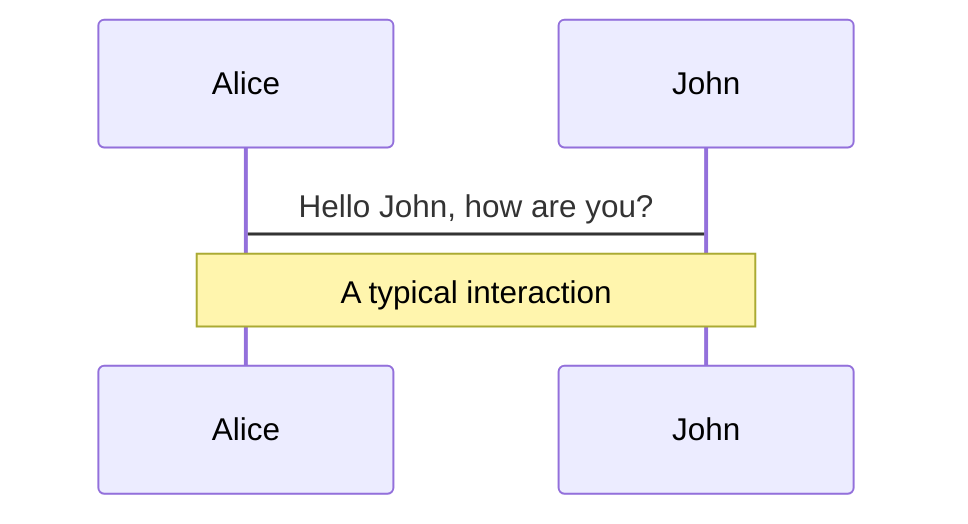
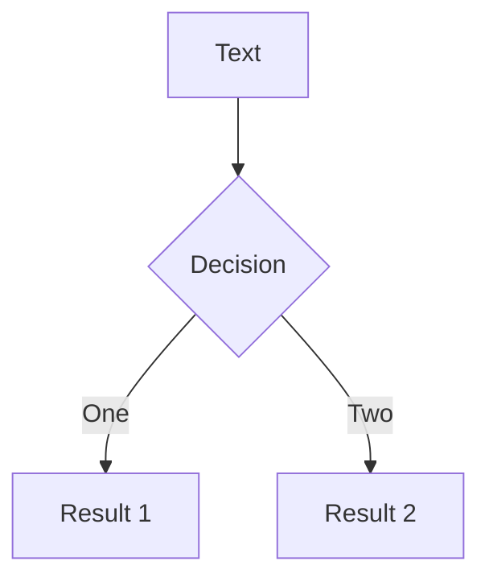
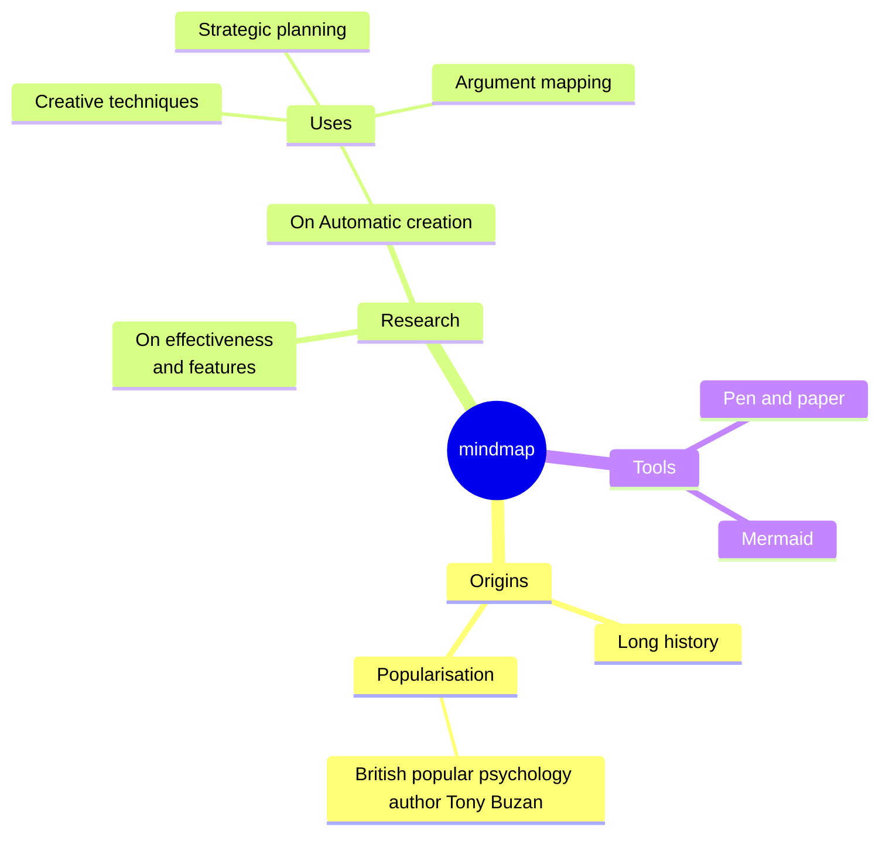
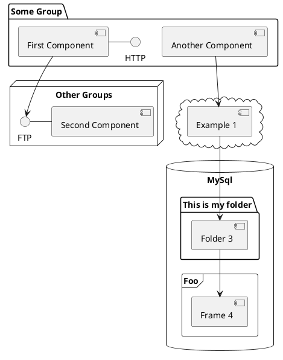

---
# try also 'default' to start simple
theme: ./theme
# random image from a curated Unsplash collection by Anthony
# like them? see https://unsplash.com/collections/94734566/slidev
background: './rubin.png'
# some information about your slides (markdown enabled)
title: CC w/ OS 4 GPX
info: |
  ## Intro to using Claude Code with OpenSpec to build software
# apply UnoCSS classes to the current slide
class: text-center
# https://sli.dev/features/drawing
drawings:
  persist: false
# slide transition: https://sli.dev/guide/animations.html#slide-transitions
transition: slide-left
# enable Comark Syntax: https://comark.dev/syntax/markdown
comark: true
---

# CC w/ OS 4 GPX

<!--
Tentative title
-->

---
transition: slide-left
class: 'flex items-center justify-center !p-0'
---


<!--
Why are we here?
-->

---
transition: slide-left
layout: image-right
image: /ralph.jpg
---

# Goals

<v-clicks>

- Feel comfortable using the CC TUI to build software using the OpenSpec framework
- A better understanding of the current state of the art
- Ideas for further research

</v-clicks>

<v-click>

## Non-goals

- Building a unicorn B2B SaaS startup in a weekend

</v-click>

---
class: text-center
---

# Structure

<div class="flex items-center justify-center gap-10 mt-32 text-6xl">
  <div class="px-10 py-8 bg-blue-900 rounded-2xl">Lecture</div>
  <div class="text-5xl">→</div>
  <div class="px-10 py-8 bg-green-900 rounded-2xl">Setup</div>
  <div class="text-5xl">→</div>
  <div class="px-10 py-8 bg-orange-900 rounded-2xl">Build</div>
</div>

---
layout: center
---

<Youtube id="SmHgtyym6OA?start=1512" width="900" height="506" />

<!-- Rich Harris - Frameworks for humans in the age of machines at NY Web Performance Meetup-->

---
layout: center
---


<!-- 
Markdown[9] is a lightweight markup language for creating formatted text using a plain-text editor.

 -->

---
class: text-center
---

<div class="flex items-center justify-center gap-24 mt-16">
  <div v-click class="flex flex-col items-center">
    
    <p class="mt-4 text-2xl">John Gruber</p>
  </div>

  <div v-click class="flex flex-col items-center">
    
    <p class="mt-4 text-2xl">Aaron Swartz</p>
  </div>
</div>

---
layout: center
---

<div class="overflow-hidden h-full w-full flex items-center justify-center">
  = 1 ? 'scale(2.0) translate(60px, -180px)' : 'none' }"
  />
</div>

<div v-click class="hidden"></div>

<!-- 
On January 6, 2011, Swartz was arrested by Massachusetts Institute of Technology (MIT) police on state breaking-and-entering charges, after connecting a computer to the MIT network in an unmarked and unlocked closet and setting it to download academic journal articles from JSTOR using a guest user account issued to him by MIT.[14][15] Federal prosecutors, led by Carmen Ortiz, charged him with two counts of wire fraud and eleven violations of the Computer Fraud and Abuse Act,[16] carrying a cumulative maximum penalty of $1 million in fines, 35 years in prison, asset forfeiture, restitution, and supervised release.[17] Swartz declined a plea bargain under which he would have served six months in federal prison.[18] Two days after the prosecution rejected a counter-offer by Swartz, he was found dead in his Brooklyn apartment.[19][20] In 2013, Swartz was inducted posthumously into the Internet Hall of Fame.[21]
 -->

---
class: 'flex !p-0'
---

<div class="w-1/2 flex items-center p-12">

<v-click>

> One of Altman’s batch mates in the first Y Combinator cohort was Aaron Swartz, a brilliant but troubled coder who died by suicide in 2013 and is now remembered in many tech circles as something of a sage. Not long before his death, Swartz expressed concerns about Altman to several friends. “You need to understand that Sam can never be trusted,” he told one. “He is a sociopath. He would do anything.”
>
> <span class="block mt-4 text-sm opacity-70">— Ronan Farrow & Andrew Marantz, <cite>“Sam Altman May Control Our Future—Can He Be Trusted?”</cite>, The New Yorker, April 6 2026</span>

</v-click>

</div>

<div class="w-1/2 h-full">
  <video autoplay loop muted class="w-full h-full object-cover">
    <source src="/altman_small.mp4" type="video/mp4" />
  </video>
</div>

---
layout: center
---

<PileUp
  :images="[
    '/Screenshot 2026-04-14 at 21.20.04.png',
    '/Screenshot 2026-04-14 at 21.21.17.png',
    '/Screenshot 2026-04-14 at 21.21.52.png',
    '/Screenshot 2026-04-14 at 21.22.38.png',
    '/Screenshot 2026-04-14 at 21.44.00.png',
    '/done_with_ai.png',
    '/ai_still_sucks.png',
    '/Screenshot 2026-04-14 at 22.07.05.png',
    '/molotov.png'
  ]"
  width="400px"
  class="mt-8"
/>

<!-- 

So should we boycott AI?

 -->

---
layout: center
---

<div class="relative flex items-center justify-center">
  <div class="breathe-bubble"></div>
  <p class="relative z-10">Let’s take a minute</p>
</div>

<style>
  p {
    font-family: 'Mort', sans-serif;
    font-size: 3rem;
  }
  .breathe-bubble {
    position: absolute;
    width: 30rem;
    height: 30rem;
    border-radius: 9999px;
    background: radial-gradient(circle, color-mix(in oklch, var(--color-primary) 45%, transparent) 0%, color-mix(in oklch, var(--color-primary) 0%, transparent) 80%);
    filter: blur(12px);
    animation: breathe 8s ease-in-out infinite;
    transform-origin: center;
  }
  @keyframes breathe {
    0%, 100% { transform: scale(0.6); opacity: 0.6; }
    50%      { transform: scale(1.1); opacity: 1;   }
  }
</style>

---
class: text-center
---

# Chat interfaces

<p class="opacity-60 -mt-2">The "text box" — general-purpose AI assistants</p>

<div class="grid grid-cols-3 gap-4 mt-8 px-12">
  <div class="p-4 bg-white/5 rounded-xl border border-white/10">
    <div class="text-xl font-semibold">ChatGPT</div>
    <div class="text-sm opacity-60">OpenAI</div>
  </div>
  <div class="p-4 bg-white/5 rounded-xl border border-white/10">
    <div class="text-xl font-semibold">Claude.ai</div>
    <div class="text-sm opacity-60">Anthropic</div>
  </div>
  <div class="p-4 bg-white/5 rounded-xl border border-white/10">
    <div class="text-xl font-semibold">Gemini</div>
    <div class="text-sm opacity-60">Google</div>
  </div>
  <div class="p-4 bg-white/5 rounded-xl border border-white/10">
    <div class="text-xl font-semibold">Copilot</div>
    <div class="text-sm opacity-60">Microsoft</div>
  </div>
  <div class="p-4 bg-white/5 rounded-xl border border-white/10">
    <div class="text-xl font-semibold">Perplexity</div>
    <div class="text-sm opacity-60">answer engine</div>
  </div>
  <div class="p-4 bg-white/5 rounded-xl border border-white/10">
    <div class="text-xl font-semibold">Grok</div>
    <div class="text-sm opacity-60">xAI</div>
  </div>
</div>

<!--
A conversation window where you type a prompt and get a response. The most widely adopted form factor.

ChatGPT (OpenAI) — The category-defining product, now on GPT-5.4. Remains the most used AI chatbot globally with 300M+ weekly active users. The Swiss army knife: writing, analysis, code, image generation, web search. Deeply integrated with Microsoft 365 via Copilot.

Claude.ai (Anthropic) — Known for strong writing quality, coding, and long-context work (up to 1M tokens). Features like Projects for persistent context, deep research, and computer use capabilities. Has carved out a strong position among developers and knowledge workers.

Gemini (Google) — Gemini 3 series with a native 1M-token context window. Tightly integrated with Google Workspace (Gmail, Docs, Drive). Deep Think mode for complex reasoning. The natural pick for Google-ecosystem organizations.

Microsoft Copilot — Built on OpenAI's GPT models but differentiated by deep integration into Microsoft 365 (Word, Excel, PowerPoint, Teams, Outlook). More of a "productivity co-pilot embedded in your work tools" than a standalone chat destination.

Perplexity — Positioned as an "answer engine" rather than a chatbot. Specializes in real-time, source-cited research. Often used as a complement to the others for fact-checking and discovery.

Grok (xAI) — Optimized for fast, conversational use, integrated into X (Twitter). Claimed to have one of the lowest hallucination rates.
-->

---
class: text-center
---

# Tab-completion

<p class="opacity-60 -mt-2">Lives in your IDE — suggests code as you type</p>

<div class="grid grid-cols-2 gap-4 mt-8 px-24">
  <div class="p-4 bg-white/5 rounded-xl border border-white/10">
    <div class="text-xl font-semibold">GitHub Copilot</div>
    <div class="text-sm opacity-60">the original, broad IDE support</div>
  </div>
  <div class="p-4 bg-white/5 rounded-xl border border-white/10">
    <div class="text-xl font-semibold">Cursor</div>
    <div class="text-sm opacity-60">VS Code fork rebuilt around AI</div>
  </div>
  <div class="p-4 bg-white/5 rounded-xl border border-white/10">
    <div class="text-xl font-semibold">Windsurf</div>
    <div class="text-sm opacity-60">Codeium — same lane, lower price</div>
  </div>
  <div class="p-4 bg-white/5 rounded-xl border border-white/10">
    <div class="text-xl font-semibold">Supermaven · Tabnine</div>
    <div class="text-sm opacity-60">earlier generation</div>
  </div>
</div>

<!--
These live inside your existing IDE and augment the developer's flow — suggesting code as you type, completing functions, answering questions inline. The developer stays in the driver's seat.

GitHub Copilot — The original, launched 2021. Works as a plugin across VS Code, JetBrains, Neovim, Xcode, and more. Pioneered the inline autocomplete experience. In 2026 it added Agent Mode with multi-step task capabilities, but its core strength remains broad IDE compatibility and the GitHub ecosystem integration (turning issues into PRs autonomously). Entry point at $10/month.

Cursor — A VS Code fork rebuilt entirely around AI. Not a plugin — the AI is the editor. Supermaven autocomplete engine achieves ~72% acceptance rate. Composer and Agent modes for multi-file changes. The most commercially successful AI coding tool (~$2B ARR). $20/month. Best daily-driver IDE for AI-first development.

Windsurf (Codeium) — A capable AI editor at a lower price point, competing in the same lane as Cursor. Free for individuals.

Supermaven / Codeium / Tabnine — Earlier-generation tab-completion tools, now largely being absorbed into or outcompeted by the above.
-->

---
class: text-center
---

# Vibecoding

<p class="opacity-60 -mt-2">Describe what you want — get a working app</p>

<div class="grid grid-cols-2 gap-4 mt-8 px-24">
  <div class="p-4 bg-white/5 rounded-xl border border-white/10">
    <div class="text-xl font-semibold">Lovable</div>
    <div class="text-sm opacity-60">full-stack from chat</div>
  </div>
  <div class="p-4 bg-white/5 rounded-xl border border-white/10">
    <div class="text-xl font-semibold">Bolt.new</div>
    <div class="text-sm opacity-60">browser, fastest scaffolding</div>
  </div>
  <div class="p-4 bg-white/5 rounded-xl border border-white/10">
    <div class="text-xl font-semibold">v0</div>
    <div class="text-sm opacity-60">Vercel — React UI components</div>
  </div>
  <div class="p-4 bg-white/5 rounded-xl border border-white/10">
    <div class="text-xl font-semibold">Replit</div>
    <div class="text-sm opacity-60">all-in-one browser IDE</div>
  </div>
</div>

<!--
The Andrej Karpathy "vibe coding" wave: describe what you want in natural language, get a working app. Targeted at non-developers or rapid prototyping. You don't write code — you converse.

Lovable (formerly GPT Engineer) — Lowest barrier to entry for full-stack apps. Chat-based: describe your app, get frontend + backend + database + auth. SOC 2 / ISO 27001 compliant. GitHub two-way sync. The go-to recommendation for non-technical founders building MVPs.

Bolt.new (StackBlitz) — Browser-based prompt-to-app. Fastest initial scaffolding (~3 min). Supports the widest framework range (React, Vue, Svelte, Angular, Expo for mobile). Great for rapid prototypes, less suited for production maintenance.

v0 (Vercel) — Focused on generating production-quality React/Next.js UI components using shadcn/ui and Tailwind. Frontend-only — no built-in database or auth. Best for developers who want polished UI components and already have a backend plan. Smoothest deployment flow (Vercel native).

Replit — All-in-one browser IDE with the Replit Agent. Code generation, database, auth, and hosting in one platform. The most feature-rich option, though it exposes more technical complexity. ~75% of users reportedly never write traditional code.
-->

---
class: text-center
---

# Agentic coding

<p class="opacity-60 -mt-2">Describe the task — the agent plans, edits, runs, iterates</p>

<div class="grid grid-cols-3 gap-4 mt-8 px-12">
  <div class="p-4 bg-white/5 rounded-xl border border-white/10">
    <div class="text-xl font-semibold">Claude Code</div>
    <div class="text-sm opacity-60">Anthropic — terminal native</div>
  </div>
  <div class="p-4 bg-white/5 rounded-xl border border-white/10">
    <div class="text-xl font-semibold">Copilot Coding Agent</div>
    <div class="text-sm opacity-60">GitHub-integrated</div>
  </div>
  <div class="p-4 bg-white/5 rounded-xl border border-white/10">
    <div class="text-xl font-semibold">Cursor Agent</div>
    <div class="text-sm opacity-60">in-editor agent mode</div>
  </div>
  <div class="p-4 bg-white/5 rounded-xl border border-white/10">
    <div class="text-xl font-semibold">Aider</div>
    <div class="text-sm opacity-60">open-source, model-agnostic</div>
  </div>
  <div class="p-4 bg-white/5 rounded-xl border border-white/10">
    <div class="text-xl font-semibold">Codex CLI</div>
    <div class="text-sm opacity-60">OpenAI</div>
  </div>
  <div class="p-4 bg-white/5 rounded-xl border border-white/10">
    <div class="text-xl font-semibold">OpenCode</div>
    <div class="text-sm opacity-60">open-source, BYOK</div>
  </div>
</div>

<!--
These operate at a higher level of autonomy. You describe a task, the agent plans, reads your codebase, writes across multiple files, runs tests, and iterates. The developer reviews results rather than directing each keystroke.

Claude Code (Anthropic) — Terminal-native agent. Reads your entire codebase (up to 1M tokens of context), autonomously writes, refactors, debugs, and runs commands. The strongest autonomous coding agent on the market as of early 2026. Extensible via MCP servers and custom skills. Best for complex, multi-file tasks, large refactors, architecture changes. $20/month via Claude Pro or pay-per-token API.

GitHub Copilot Coding Agent — Assigns a GitHub issue to Copilot, it spins up a VM, clones your repo, writes code, runs tests, opens a PR. Less autonomous depth than Claude Code but deeply integrated into the GitHub workflow. Accessible for teams already on GitHub.

Cursor Agent Mode — Cursor's agentic layer within the IDE. Can spawn async subagents (as of Cursor 2.5, Feb 2026) for coordinated multi-file work. Less autonomous than Claude Code but integrated into the editor UX.

Aider — Open-source terminal agent. Git-integrated workflow, supports multiple models. Appeals to developers who want transparency and model flexibility without vendor lock-in.

OpenAI Codex CLI — OpenAI's terminal-based agentic coding tool. Competes in the same lane as Claude Code.

OpenCode — Open source, bring your own keys.
-->

---
class: text-center
---

# AI-native design

<p class="opacity-60 -mt-2">Design tools agents can read from <em>and</em> write to</p>

<div class="grid grid-cols-2 gap-6 mt-8 px-12 text-left">
  <div>
    <h6 class="opacity-100 mb-2">0 → 1 generation</h6>
    <div class="space-y-2">
      <div class="p-3 bg-white/5 rounded-xl border border-white/10">
        <div class="font-semibold">Google Stitch</div>
        <div class="text-sm opacity-60">prompt → multi-screen, MCP out</div>
      </div>
      <div class="p-3 bg-white/5 rounded-xl border border-white/10">
        <div class="font-semibold">Figma AI Agents</div>
        <div class="text-sm opacity-60">agents inside your design system</div>
      </div>
    </div>
  </div>
  <div>
    <h6 class="opacity-100 mb-2">Design ↔ code canvases</h6>
    <div class="space-y-2">
      <div class="p-3 bg-white/5 rounded-xl border border-white/10">
        <div class="font-semibold">Pencil.dev</div>
        <div class="text-sm opacity-60">.pen files in your repo</div>
      </div>
      <div class="p-3 bg-white/5 rounded-xl border border-white/10">
        <div class="font-semibold">Paper.design</div>
        <div class="text-sm opacity-60">canvas built on real HTML/CSS</div>
      </div>
      <div class="p-3 bg-white/5 rounded-xl border border-white/10">
        <div class="font-semibold">OpenPencil</div>
        <div class="text-sm opacity-60">open-source, agent teams</div>
      </div>
    </div>
  </div>
</div>

<!--
The newest modality — emerging in late 2025 and exploding in early 2026. The core idea: design tools that AI agents can both read from and write to, closing the design-to-code gap. MCP (Model Context Protocol) is the connective tissue — it lets coding agents like Claude Code or Cursor pull design context directly, eliminating the traditional Figma-to-developer handoff.

Google Stitch — Google's free AI design tool (originally acquired as Galileo AI). The March 2026 update was a watershed: voice canvas, infinite canvas, multi-screen generation (up to 5 connected screens from one prompt), and an MCP server that pipes designs directly into Claude Code, Cursor, or Google's own Antigravity IDE. Powered by Gemini 3 Flash/Pro. 350 free generations/month. Caused Figma's stock to drop ~9% in a day. Dominates the "blank page to first draft" phase — generating a complete landing page in under a minute — but lacks collaboration features, design system enforcement, and polished production output. The emerging consensus: use Stitch to start, Figma to finish.

Figma AI Agents + Figma MCP — Figma's counter-move, launched days after the Stitch update. Rather than generating designs from scratch, Figma opened its canvas to AI agents via its own MCP server. Agents get full access to your component library, variables, tokens, and auto layout. Combined with "Skills" (markdown files teaching agents your team's conventions), the output follows your existing brand guidelines. The opposite philosophy to Stitch: Stitch generates from outside, Figma's agents work from inside your design system. The MCP server bridges to Claude Code, Cursor, and VS Code Copilot, sending structured React + Tailwind representations of selected designs. Requires a paid Figma plan.

Pencil.dev — An AI-native design canvas that lives inside your IDE (VS Code/Cursor extension or desktop app). The key insight: designs are stored as .pen files in your Git repo — version-controlled, AI-readable, and part of your codebase. Multiple AI agents (up to 6) work simultaneously on the canvas. Deeply integrated with Claude Code via MCP — describe a UI in natural language and watch it materialize on the canvas, then export as React/Tailwind/HTML. Backed by a16z Speedrun. Currently free. Best thought of as "design mode for Claude Code" — the tool that gives AI coding agents a visual surface to work on.

Paper.design — A design canvas built on real HTML and CSS (not a proprietary format). Everything you design renders as actual web elements with real flexbox layouts and CSS properties — no conversion step needed. Exports as React, Tailwind, PNG, WebP, or video. Its MCP server exposes 24 tools for both reading and writing, so any AI agent can create frames, update styles, set text, or retrieve JSX output. Built-in AI image generation (Flux 2, Gemini, OpenAI). Currently in open alpha. $16/month Pro plan. The philosophical distinction from Pencil: Paper is more design-tool-first with agent support, while Pencil is more agent-first with a design canvas.

OpenPencil — Two separate open-source projects share this name: one focused on Figma-compatible visual design with .fig file support, and another (by ZSeven-W) focused on concurrent Agent Teams where multiple AI agents design in parallel on a shared canvas. Both are MIT/GPL licensed, early-stage, and represent the open-source push in this space.

Workflow forming in 2026: Explore in Stitch → Refine in Figma → Bridge through Pencil or Paper + MCP → Build in Claude Code or Cursor.
-->


---
class: text-center
---

# Spec-driven development

<p class="opacity-60 -mt-2">Give the agent a spec — let it implement against a contract</p>

<div class="grid grid-cols-2 gap-4 mt-8 px-24">
  <div class="p-4 bg-white/5 rounded-xl border border-white/10">
    <div class="text-xl font-semibold">Spec Kit</div>
    <div class="text-sm opacity-60">GitHub — Specify · Plan · Tasks · Implement</div>
  </div>
  <div class="p-4 bg-white/5 rounded-xl border border-white/10">
    <div class="text-xl font-semibold">OpenSpec</div>
    <div class="text-sm opacity-60">Fission AI — lightweight, brownfield-first</div>
  </div>
  <div class="p-4 bg-white/5 rounded-xl border border-white/10">
    <div class="text-xl font-semibold">Kiro</div>
    <div class="text-sm opacity-60">AWS — agentic IDE, EARS notation</div>
  </div>
  <div class="p-4 bg-white/5 rounded-xl border border-white/10">
    <div class="text-xl font-semibold">BMAD-METHOD</div>
    <div class="text-sm opacity-60">multi-agent personas, PRDs first</div>
  </div>
</div>

<!--
The central idea: don't prompt AI to write code — give it a specification and let agents implement against a contract. Specs become the source of truth, not the code.

Spec Kit (GitHub) — GitHub's official open-source SDD toolkit. Four-phase workflow: Specify → Plan → Tasks → Implement. Works with Copilot, Claude Code, Gemini CLI, and others via a CLI (specify) that scaffolds spec files into your repo. The spec acts as a constitution — every AI action is governed by it. Recently added YAML-based resumable workflow pipelines with human review gates and fan-out parallelism. Relatively heavyweight (Python setup, rigid phase gates), best for medium-to-large greenfield features where the upfront planning investment pays off.

OpenSpec (Fission AI) — The lightweight, brownfield-first alternative to Spec Kit. Three-phase state machine: Propose → Apply → Archive. Each change gets its own folder with proposal, specs, design, and tasks — all living in your repo alongside your code. The key differentiator: delta markers (ADDED/MODIFIED/REMOVED) that track what's changing relative to existing behavior, making it work well for iterating on existing codebases, not just greenfield. Works with 25+ tools via slash commands. No Python, no API keys, 5-minute setup. Often combined with Ralph loops for execution.

Kiro (Amazon/AWS) — An agentic IDE (VS Code fork) with spec-driven development built into the core UX. Uses EARS notation (Easy Approach to Requirements Syntax) to turn natural language into structured requirements with acceptance criteria. Generates a three-document spec system, then breaks it into implementation tasks. Agents operate within the IDE with deep AWS integration. Unique feature: "hooks" — event-driven agents that trigger on file save to auto-generate tests, docs, or optimizations. Cloud-agnostic in principle, but the tightest ecosystem fit is with AWS.

BMAD-METHOD (Breakthrough Method of Agile AI-Driven Development) — The most comprehensive and heavyweight framework. A multi-agent orchestration system where specialized AI personas (Analyst, PM, Architect, Developer, QA) collaborate through structured, version-controlled files. Expansion Packs add domain-specific agents (e.g., Game Level Designer, Narrative Designer). Works with any IDE. Two phases: planning agents create PRDs and architecture docs, then a Scrum Master agent transforms them into hyper-detailed development stories. Enterprise-grade but steep learning curve. Best for complex, multi-domain projects where upfront planning prevents costly rework.
-->

---
class: text-center
---

# Autonomous loops

<p class="opacity-60 -mt-2">Disposable sessions — fresh context, git as memory</p>

<div class="grid grid-cols-2 gap-4 mt-8 px-32">
  <div class="p-4 bg-white/5 rounded-xl border border-white/10">
    <div class="text-xl font-semibold">Ralph loops</div>
    <div class="text-sm opacity-60">Huntley — bash <code>while</code>, fresh agent each iter</div>
  </div>
  <div class="p-4 bg-white/5 rounded-xl border border-white/10">
    <div class="text-xl font-semibold">GSD</div>
    <div class="text-sm opacity-60">Discuss · Research · Plan · Execute · Verify</div>
  </div>
</div>

<!--
These solve the context window problem: a single agent session degrades as context fills up. The answer is to make each session disposable — loop the agent, give each iteration fresh context, let state persist on disk and in git.

Ralph loops (Geoffrey Huntley) — The original pattern, named after Ralph Wiggum from The Simpsons. Elegantly simple: a bash while loop that repeatedly feeds a PRD to Claude Code (or Amp, Codex, Gemini CLI, etc.). Each iteration spawns a fresh agent with a clean context window. Memory persists via git history, a progress.txt file, and a prd.json checklist. The agent picks the next unchecked item, implements it, commits, exits. Next iteration starts fresh. "Deterministically bad in an undeterministic world." Multiple implementations exist (snarktank/ralph, PageAI/ralph-loop, Vercel Labs/ralph-loop-agent as an npm SDK). The technique has become foundational — GSD, OpenSpec, and others build on it.

GSD (Get Stuff Done) — Started as a meta-prompting framework for Claude Code with ~23K GitHub stars, now evolved into a standalone CLI (GSD v2) built on the Pi SDK with direct TypeScript control over the agent harness. Splits work into phases: Discuss → Research → Plan → Execute → Verify → Reassess. Each plan is aggressively atomic (2–3 tasks, designed to fit in ~50% of a fresh context window). Spawns sub-agents for each task with exactly the relevant files pre-loaded. Built-in quality gates: schema drift detection, security enforcement, scope reduction detection. Supports 14+ agent runtimes including Claude Code, Codex, Gemini CLI, Cursor, Copilot, Windsurf, and others. The "one command, walk away, come back to a built project" promise.
-->

---
class: text-center
---

# Multi-agent orchestration

<p class="opacity-60 -mt-2">The frontier — many agents, coordinated roles, shared memory</p>

<div class="flex justify-center mt-8 px-32">
  <div class="p-6 bg-white/5 rounded-xl border border-white/10 max-w-md">
    <div class="text-2xl font-semibold">Gas Town</div>
    <div class="text-sm opacity-60 mt-2">Steve Yegge — Mayor orchestrates 20–30+ Claude Code instances · Polecats · Witness · Refinery · Beads memory</div>
  </div>
</div>

<!--
The frontier: not one agent looping, but many agents working in parallel with coordination, persistent identity, and shared memory.

Gas Town (Steve Yegge) — The most ambitious and speculative system. A full multi-agent workspace manager where a "Mayor" agent orchestrates 20–30+ parallel Claude Code instances with specialized roles (Polecats execute tasks, Witness monitors health, Refinery manages merges). Built on Beads, Yegge's git-backed issue-tracking memory system that gives agents persistent identity across sessions. Introduces "GUPP" (if there's work on your hook, you must run it) as the core coordination primitive. Uses git worktrees for isolation — each agent works in its own directory. Currently chaotic and expensive ($100+/hour burns reported), explicitly not recommended for production use yet, but directionally important. Yegge's 8 Levels of Agentic Coding (from "maybe code completions" at Level 1 to "building your own orchestrator" at Level 8) has become a widely-referenced maturity model for how developers evolve with these tools.
-->

---
class: text-center
---

# Maturity spectrum

<p class="opacity-60 -mt-2">Where you are on the curve</p>

<div class="flex flex-col gap-3 mt-8 px-24 text-left">
  <div class="p-4 bg-white/5 rounded-xl border border-white/10 flex items-center gap-4">
    <div class="text-3xl opacity-40 w-10 text-center">1</div>
    <div>
      <div class="text-lg font-semibold">Vibe coding</div>
      <div class="text-sm opacity-60">no framework, just chat — fine for small tasks</div>
    </div>
  </div>
  <div class="p-4 bg-white/5 rounded-xl border border-white/10 flex items-center gap-4">
    <div class="text-3xl opacity-40 w-10 text-center">2</div>
    <div>
      <div class="text-lg font-semibold">Spec-driven</div>
      <div class="text-sm opacity-60">OpenSpec · Spec Kit — define what to build first</div>
    </div>
  </div>
  <div class="p-4 bg-white/5 rounded-xl border border-white/10 flex items-center gap-4">
    <div class="text-3xl opacity-40 w-10 text-center">3</div>
    <div>
      <div class="text-lg font-semibold">Autonomous loops</div>
      <div class="text-sm opacity-60">Ralph · GSD — unattended, ship overnight</div>
    </div>
  </div>
  <div class="p-4 bg-white/5 rounded-xl border border-white/10 flex items-center gap-4">
    <div class="text-3xl opacity-40 w-10 text-center">4</div>
    <div>
      <div class="text-lg font-semibold">Multi-agent orchestration</div>
      <div class="text-sm opacity-60">Gas Town · BMAD — frontier, powerful but raw</div>
    </div>
  </div>
</div>

<!--
A useful framing — these frameworks map to different levels of AI coding maturity:

Ad-hoc prompting / vibe coding → No framework, just chat with the agent. Works for small tasks.
Spec-driven (OpenSpec, Spec Kit) → You define what to build before the agent writes code. Predictable, reviewable.
Autonomous loops (Ralph, GSD) → Agent runs unattended, fresh context per task, git as memory. Ship overnight.
Multi-agent orchestration (Gas Town, BMAD) → Many agents, specialized roles, coordinated workflows. The frontier — powerful but still raw.

Most productive teams in 2026 are at the spec-driven + loop layer. Multi-agent orchestration is where things are heading but the tooling is still maturing fast.
-->


---

# Diagrams

You can create diagrams / graphs from textual descriptions, directly in your Markdown.

<div class="grid grid-cols-4 gap-5 pt-4 -mb-6">









</div>

Learn more: [Mermaid Diagrams](https://sli.dev/features/mermaid) and [PlantUML Diagrams](https://sli.dev/features/plantuml)

---
foo: bar
dragPos:
  square: 691,32,167,_,-16
---

# Draggable Elements

Double-click on the draggable elements to edit their positions.

<br>

###### Directive Usage

```md

```

<br>

###### Component Usage

```md
<v-drag text-3xl>
  <div class="i-carbon:arrow-up" />
  Use the `v-drag` component to have a draggable container!
</v-drag>
```

<v-drag pos="663,206,261,_,-15">
  <div text-center text-3xl border border-main rounded>
    Double-click me!
  </div>
</v-drag>


###### Draggable Arrow

```md
<v-drag-arrow two-way />
```

<v-drag-arrow pos="67,452,253,46" two-way op70 />

---
src: ./pages/imported-slides.md
hide: false
---

---

# Monaco Editor

Slidev provides built-in Monaco Editor support.

Add `{monaco}` to the code block to turn it into an editor:

```ts {monaco}
import { ref } from 'vue'
import { emptyArray } from './external'

const arr = ref(emptyArray(10))
```

Use `{monaco-run}` to create an editor that can execute the code directly in the slide:

```ts {monaco-run}
import { version } from 'vue'
import { emptyArray, sayHello } from './external'

sayHello()
console.log(`vue ${version}`)
console.log(
  emptyArray<number>(10).reduce(
    (fib) => [...fib, fib.at(-1)! + fib.at(-2)!],
    [1, 1],
  ),
)
```


---
class: '!p-0 !overflow-hidden relative'
---

<ImageGrid
  :images="[
    '/gridImages/Screenshot 2026-04-14 at 22.25.25.png',
    '/gridImages/Screenshot 2026-04-14 at 22.25.43.png',
    '/gridImages/Screenshot 2026-04-14 at 22.25.50.png',
    '/gridImages/Screenshot 2026-04-14 at 22.28.44.png',
    '/gridImages/Screenshot 2026-04-14 at 22.29.07.png',
    '/gridImages/Screenshot 2026-04-14 at 22.29.23.png',
    '/gridImages/Screenshot 2026-04-14 at 22.29.28.png',
    '/gridImages/Screenshot 2026-04-14 at 22.29.41.png',
    '/gridImages/Screenshot 2026-04-14 at 22.29.59.png',
    '/gridImages/Screenshot 2026-04-14 at 22.30.04.png',
    '/gridImages/Screenshot 2026-04-14 at 22.30.21.png',
    '/gridImages/Screenshot 2026-04-14 at 22.30.24.png',
    '/gridImages/Screenshot 2026-04-14 at 22.30.33.png',
    '/gridImages/Screenshot 2026-04-14 at 22.30.45.png',
    '/gridImages/Screenshot 2026-04-14 at 22.30.55.png',
    '/gridImages/Screenshot 2026-04-14 at 22.31.03.png',
    '/gridImages/Screenshot 2026-04-14 at 22.31.37.png',
    '/gridImages/Screenshot 2026-04-14 at 22.31.45.png',
    '/gridImages/Screenshot 2026-04-14 at 22.31.54.png',
    '/gridImages/Screenshot 2026-04-14 at 22.32.06.png',
    '/gridImages/Screenshot 2026-04-14 at 22.32.27.png',
    '/gridImages/Screenshot 2026-04-14 at 22.32.50.png',
    '/gridImages/Screenshot 2026-04-14 at 22.33.11.png',
    '/gridImages/Screenshot 2026-04-14 at 22.33.18.png',
    '/gridImages/Screenshot 2026-04-14 at 22.33.30.png',
    '/gridImages/Screenshot 2026-04-14 at 22.33.39.png',
    '/gridImages/Screenshot 2026-04-14 at 22.33.49.png',
    '/gridImages/Screenshot 2026-04-14 at 22.34.11.png',
    '/gridImages/Screenshot 2026-04-14 at 22.34.15.png',
    '/gridImages/Screenshot 2026-04-14 at 22.34.27.png',
    '/gridImages/Screenshot 2026-04-14 at 22.34.43.png',
    '/gridImages/Screenshot 2026-04-14 at 22.34.54.png',
    '/gridImages/Screenshot 2026-04-14 at 22.35.29.png',
    '/gridImages/Screenshot 2026-04-14 at 22.35.39.png',
    '/gridImages/Screenshot 2026-04-14 at 22.35.46.png',
    '/gridImages/Screenshot 2026-04-14 at 22.36.17.png',
    '/gridImages/Screenshot 2026-04-14 at 22.36.30.png',
    '/gridImages/Screenshot 2026-04-14 at 22.36.52.png',
  ]"
/>

---


---
layout: center
---

<Youtube id="5dEp1ZpYDUg?start=88" width="900" height="506" />

---
layout: center
class: text-center
---

# Learn More

[Documentation](https://sli.dev) · [GitHub](https://github.com/slidevjs/slidev) · [Showcases](https://sli.dev/resources/showcases)

<PoweredBySlidev mt-10 />
